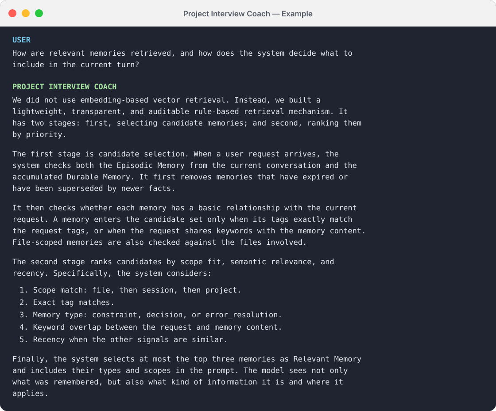

# Project Interview Coach

English | [简体中文](README.zh-CN.md)

A Codex Skill for project-based technical interviews. It uses your actual project materials to uncover what an interviewer is evaluating, craft evidence-grounded answers, prepare for follow-up questions, and run mock interviews.

It works well for software engineering, data, machine learning, research, product, and other interviews centered on project experience.

## Features

- **Grounded in your real work**: Inspects project code, resume bullets, architecture notes, experiment results, and previous answers instead of inventing implementation details or metrics.
- **Understands interviewer intent**: Identifies the core competency behind each question, including architecture, technical trade-offs, reliability, evaluation, and personal ownership.
- **Produces natural spoken answers**: Turns project facts into clear interview responses rather than documentation-style feature lists.
- **Supports multiple practice modes**: Draft answers, review and rewrite existing responses, conduct one-question-at-a-time mock interviews, or generate project-specific questions.
- **Keeps claims credible**: Separates verified facts from reasonable interpretation and states the limits of experiments and conclusions.

## Example Output

The following example shows how the Skill turns implementation details into a structured, conversational interview answer.



## Installation

### Easiest option: ask Codex to install it

No terminal or Bash knowledge is required. Open Codex, start a task, and paste the following message:

```text
Use $skill-installer to install the project-interview-coach Skill from this GitHub repository:
https://github.com/EliaukoaYoW/project-interview-coach

The Skill is located in the project-interview-coach subdirectory. After installing it,
confirm the installation location and tell me how to use it.
```

Codex will download the repository and install the Skill for you. If Codex asks for permission to access the network or write to your personal Skills directory, review the request and approve it to continue. The Skill will be available on your next turn; you can then try:

```text
Use $project-interview-coach to inspect my current project and generate five likely interview questions.
```

If Codex reports that a Skill with the same name already exists, ask it to check the installed version before replacing anything.

### Manual installation with Git

Clone the repository and copy the Skill into your personal Codex Skills directory:

```bash
git clone https://github.com/EliaukoaYoW/project-interview-coach.git
cd project-interview-coach
mkdir -p ~/.codex/skills
cp -R project-interview-coach ~/.codex/skills/
```

The installed files should look like this:

```text
~/.codex/skills/
└── project-interview-coach/
    ├── SKILL.md
    └── agents/
        └── openai.yaml
```

Restart Codex or start a new task so that the Skill is loaded again.

## Usage

Invoke the Skill in Codex with `$project-interview-coach`, then provide your project materials and describe what you want to practice.

### 1. Draft an interview answer

```text
Use $project-interview-coach to inspect this project's code and README, then help me answer:
“Why did you choose this architecture, and what problem did it solve?”
```

### 2. Improve an existing answer

```text
Use $project-interview-coach to review and rewrite the answer below.
Focus on whether the technical reasoning, my contribution, and the supporting evidence are clear:

[Paste your answer here]
```

### 3. Run a mock interview

```text
Use $project-interview-coach as my interviewer.
Read the current project and my resume description first. Ask one question at a time,
then follow up based on my answer without revealing the ideal answer in advance.
```

### 4. Generate project-specific questions

```text
Use $project-interview-coach to generate interview questions based on this project.
Cover motivation, architecture, core implementation, trade-offs, failure handling,
evaluation methodology, and limitations.
```

## Recommended Workflow

1. Open your project repository in Codex.
2. Provide the relevant resume bullets and any useful architecture notes, experiment results, or background information.
3. Invoke `$project-interview-coach` and choose whether you want to draft an answer, improve a response, run a mock interview, or prepare questions.
4. Add real evidence for important metrics, technical decisions, and personal contributions.
5. Ask Codex to shorten the answer, make it more conversational, or probe weak areas with follow-up questions.

The more complete your materials are, the more specific and credible the answers will be. The Skill does not fill critical gaps with plausible but unverified claims; it asks for clarification when missing information would materially change the answer.

## Project Structure

```text
.
├── README.md
├── README.zh-CN.md
├── assets/                   # README preview images
└── project-interview-coach/
    ├── SKILL.md              # Core workflow and answer guidelines
    └── agents/
        └── openai.yaml       # Display name, description, and default prompt
```

## Updating

Enter your local repository, pull the latest changes, and copy the Skill again:

```bash
git pull
cp -R project-interview-coach ~/.codex/skills/
```

If a Skill with the same name already exists, the copy command merges the directory and overwrites files with matching names. Back up any local customizations before updating.

## Uninstalling

Remove the Skill from your personal Skills directory:

```bash
rm -rf ~/.codex/skills/project-interview-coach
```

Then restart Codex or start a new task.

## Contributing

Issues and pull requests are welcome. When reporting a problem, please include the interview scenario, the expected behavior, and a sanitized example whenever possible.
