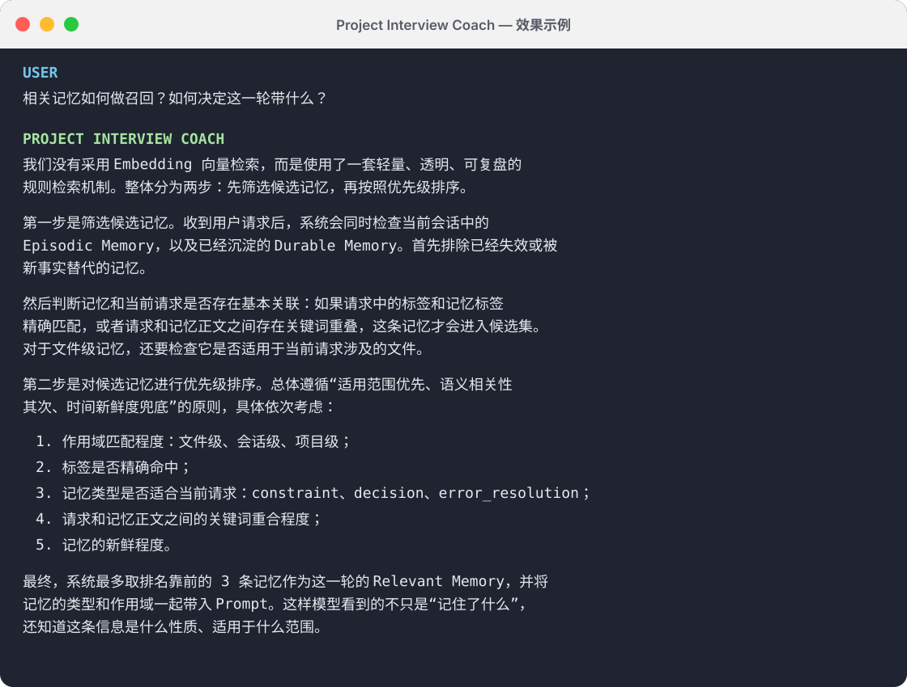

# Project Interview Coach

[English](README.md) | 简体中文

一个面向项目型技术面试的 Codex Skill。它会基于你的真实项目材料，帮助你拆解面试官意图、生成有证据支撑的回答、准备追问，并进行模拟面试。

它适用于软件工程、数据、算法、科研、产品和其他以项目经历为核心的面试场景。

## 功能特点

- **基于真实材料回答**：优先读取项目代码、简历描述、架构文档、实验数据和历史回答，不编造实现细节或指标。
- **拆解问题意图**：识别面试问题背后的核心考察点，例如架构设计、技术取舍、可靠性、评估方法和个人贡献。
- **生成自然口语回答**：把项目事实组织成适合面试现场表达的答案，而不是文档式的功能罗列。
- **支持多种练习模式**：可直接生成答案、点评并改写回答、担任面试官逐题追问，或根据项目生成问题清单。
- **强调证据与边界**：区分已经验证的事实和合理推断，同时说明实验结论、局限及适用范围。

## 效果示例

下面的示例展示了 Skill 如何将项目中的实现细节组织成结构清晰、适合口头表达的面试回答。



## 安装

### 最简单的方法：让 Codex 自动安装

你不需要了解终端或 Bash 命令。打开 Codex，新建一个任务，然后复制并发送下面这段话：

```text
使用 $skill-installer，从下面的 GitHub 仓库安装 project-interview-coach Skill：
https://github.com/EliaukoaYoW/awesome-skills

Skill 位于仓库的 project-interview-coach 子目录中。安装完成后，
请确认安装位置，并告诉我如何使用它。
```

Codex 会自动下载仓库并安装 Skill。如果 Codex 请求网络访问权限，或者请求向个人 Skills 目录写入文件，请检查授权内容并允许其继续。安装后的 Skill 会在下一轮对话中可用，你可以接着发送：

```text
使用 $project-interview-coach，阅读我当前的项目并生成 5 个可能的面试问题。
```

如果 Codex 提示已经存在同名 Skill，请先让它检查已安装的版本，再决定是否替换。

### 使用 Git 手动安装

克隆仓库，并将 Skill 复制到 Codex 的个人 Skills 目录：

```bash
git clone https://github.com/EliaukoaYoW/awesome-skills.git
cd awesome-skills
mkdir -p ~/.codex/skills
cp -R project-interview-coach ~/.codex/skills/
```

安装后的结构应为：

```text
~/.codex/skills/
└── project-interview-coach/
    ├── SKILL.md
    └── agents/
        └── openai.yaml
```

重新启动 Codex 或开启一个新任务，使 Skill 被重新加载。

## 使用方法

在 Codex 中使用 `$project-interview-coach` 调用 Skill，并附上你的项目材料和具体需求。

### 1. 生成面试回答

```text
使用 $project-interview-coach，根据这个项目的代码和 README，帮我回答：
“为什么选择这套架构？它解决了什么问题？”
```

### 2. 优化已有回答

```text
使用 $project-interview-coach 点评并改写下面这段回答。
重点检查技术逻辑、个人贡献和数据证据是否清楚：

[粘贴你的回答]
```

### 3. 进行模拟面试

```text
使用 $project-interview-coach 担任面试官。
请先阅读当前项目和我的简历项目描述，每次只问一个问题，
并根据我的回答继续追问，不要提前告诉我参考答案。
```

### 4. 生成项目追问清单

```text
使用 $project-interview-coach，根据这个项目生成一组面试问题。
覆盖项目动机、架构、核心实现、技术取舍、故障处理、评估方法和局限性。
```

## 推荐使用流程

1. 在 Codex 中打开你的项目仓库。
2. 提供简历中的项目描述，以及必要的架构文档、实验结果或背景信息。
3. 使用 `$project-interview-coach`，说明你希望生成答案、优化回答、模拟面试还是准备问题。
4. 对重要指标、技术选择和个人贡献补充真实证据。
5. 继续要求压缩答案、调整为口语表达，或针对薄弱点进行追问。

提供的材料越完整，回答就越具体、可信。Skill 不会用看似合理但未经验证的信息填补关键事实；当缺失信息会显著影响答案时，它会向你确认。

## 更新

进入本地仓库并拉取最新版本，然后重新复制 Skill：

```bash
git pull
cp -R project-interview-coach ~/.codex/skills/
```

如果目标目录中已经存在同名 Skill，复制命令会合并并覆盖同名文件。更新前如有本地自定义内容，请先做好备份。

## 卸载

删除个人 Skills 目录中的对应文件夹：

```bash
rm -rf ~/.codex/skills/project-interview-coach
```

随后重新启动 Codex 或开启一个新任务。

## 贡献

欢迎提交 Issue 或 Pull Request。建议在反馈中附上具体的面试场景、期望行为和脱敏后的示例，以便复现和改进。
